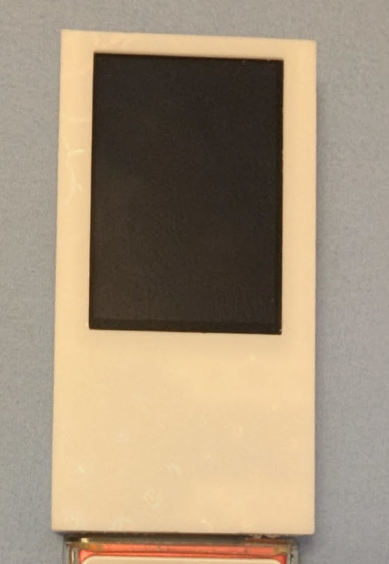
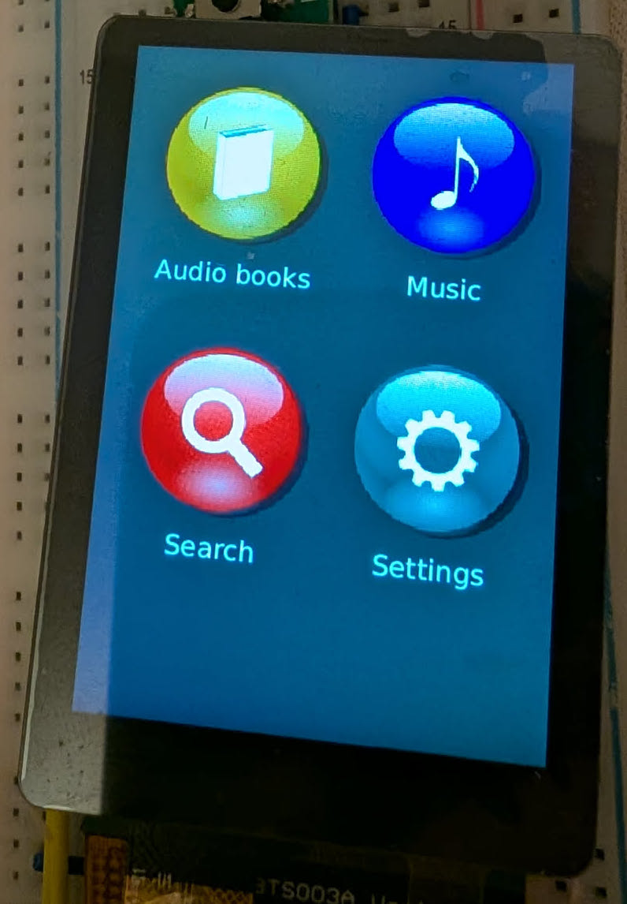
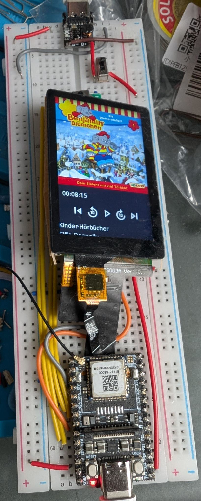

# nanowave

nanowave is planned as a DIY portable audio player developed in Rust. It is currently a proof-of-concept learning project, that has no "release", but some demos, what it should look like.

Here are some pictures, have fun...

<br>
3D printed case<br>

<br>
Feature overview<br>

<br>
Development Breadboard<br>

[](https://www.youtube.com/watch?v=vRbHiqdaSFk)

# Howto

Below is a small set of shell instructions to prepare a micro sd card for deploying 
the `nanowave` project on a LicheeRV Nano.

## Best practise

For a good introduction into the LicheeRV Hardware you can take a look at this:
https://github.com/scpcom/LicheeSG-Nano-Build/blob/develop/best-practice.md


## Hardware

- LicheeRV Nano Wifi (~15$)
  - Base module - required
- IPS 2.28" ST7701S Touch Display LHCM228TS003A (~11$)
  - The touch variant - required
- USB-C to Audio Jack Adapter, e.g. Apple (~10$)
  - Used for audio output - recommended
- TP4057 5V Battery Module (~2$)
  - Used for running the device of a battery - optional
- MAX17043 Battery gauge (~5$)
  - Planned for showing the battery percentage - optional

## Prepare the LicheeRV
```sh
# please change this to your liking
DEVICE="/dev/sdXX"
BOOT_MOUNTPOINT="/tmp/lichee-boot"
WIFI_SSID="<your-wifi-ssid>"
WIFI_PASS="<your-wifi-password>"

# NO CHANGES FROM HERE

# become root
sudo -s

# change to tmp
cd /tmp/

# download forked lichee rv nano image
wget https://github.com/scpcom/LicheeSG-Nano-Build/releases/download/v2.3.4-54/licheervnano-e_sd.img.xz

# flash image onto device
xzcat licheervnano-e_sd.img.xz | sudo dd of=$DEVICE bs=100M status=progress conv=fsync

# mount boot partition of the image
mkdir -p "$BOOT_MOUNTPOINT"
mount "${DEVICE}1" "$BOOT_MOUNTPOINT"

# enable display support
echo "panel=st7701_lhcm228ts003a" > "$BOOT_MOUNTPOINT/uEnv.txt"

# enable framebuffer
touch "$BOOT_MOUNTPOINT/fb"

# switch usb port from USB OTG (device emulation) to host mode (devices can be connected) 
rm "$BOOT_MOUNTPOINT/usb.dev" && touch "$BOOT_MOUNTPOINT/usb.host"

# enable check for audioplayer autorun
touch "$BOOT_MOUNTPOINT/audioplayer"


cat <<EOF >> "$BOOT_MOUNTPOINT/wpa_supplicant.conf"
ctrl_interface=/var/run/wpa_supplicant
ap_scan=1
network={
    ssid="$WIFI_SSID"
    psk="$WIFI_PASS"
}
EOF

```

## Build and deploying nanowave player

You need:
- Linux
- Docker (a custom docker image is required to deploy for RISC-V 64bit musl)
- Rust


Building the binaries:
```
./build-cross.sh
```

Copying the binaries to the prepared LicheeRV (`lichee` is the hostname, so adjust this if required, e.g. to the ip address of the LicheeRV):

```
scp ./target/riscv64gc-unknown-linux-musl/release/nanowave-ui lichee2:/root/nanowave
scp ./scripts/* lichee:/root/
```

## Preparing media

By default nanowave will look for a directory `./media` containing `./media/audiobooks` (`music` is not working atm).
To provide some audio files, it is recommended to copy a valid audio book file to `/root/media/audiobooks/testing.m4b`
so that nanowave can show and play some content.

## Running the player

First you need to ssh into the LicheeRV:

```sh
ssh -l root lichee
```

After you are logged in you can do the following:

```sh
# start the audio player manually
/root/audioplayer

# stop the audio player (display keeps on showing the ui)
/root/kill-audioplayer

# enable autorun for audioplayer on boot
grep -q '/boot/audioplayer' /etc/rc.local || cat <<EOF >> "/etc/rc.local"

# nanowave-ui autorun
if [ -e /boot/audioplayer ]
then
        /root/audioplayer
fi
EOF
```
